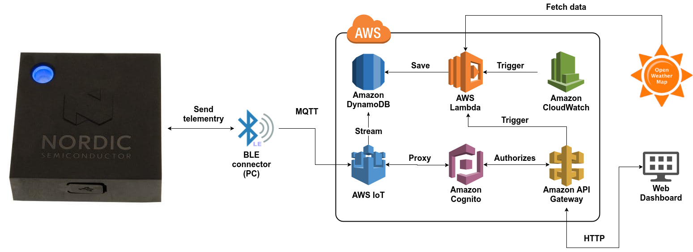

Nordic Thingy Demo Platform
=============

The platform demonstrates a [Nordic Thingy:52](https://www.nordicsemi.com/eng/Products/Nordic-Thingy-52) and [AWS](https://aws.amazon.com) integration use case.
The [back-end and front-end](docs/AWS.md) are entirely powered by [Amazon Web Services](https://aws.amazon.com/).
The device sends metrics to AWS IoT via BLE connector (PC).

You can see the live demo [here](http://iot-demo.nordic.klika-tech.com/#/dashboard).

##### Contents

- [Platform Scheme](#platform-scheme)
- [Serverless](#serverless)
- [Features](#features)
- [Back-end](#back-end)
- [Front-end](#front-end)
- [Requirements](#requirements)
- [Setup](#setup)
- [Deployment](#deployment)
- [Offline Development](#offline-development)
- [Connect device](#connect-device)
- [Device Simulation](#device-simulation)
        
### Platform Schema

  

    
    
### Serverless

Back-end (AWS-base) and front-end (SPA) running on [AWS](https://aws.amazon.com/), deployment provided via [serverless](https://serverless.com/).   [serverless.yml](../serverless.yml) - [serverless](https://serverless.com/) template provide all resources for setup cloud.

### Features

1. Template of back-end IoT application based on [AWS](https://aws.amazon.com/).
1. Web-dashboard for display.
1. Automation of deployment process.
1. Local (offline) development without deploying in the cloud.

### Back-end

The back-end is entirely powered by [Amazon Web Services](https://aws.amazon.com/). See [platform schema](#platform-scheme). If you don't have an AWS account, create one. Amazon provides the [AWS Free Tier](https://aws.amazon.com/free/) for new accounts. Demo platform is lightweight and should fit into the free tier limits.

### Front-end

It is a [React](https://facebook.github.io/react/) and [Redux](https://redux.js.org/) application which renders the board sensors data as [D3.js](https://d3js.org/) charts. On the application start, initial data set is fetched from a public API endpoint. 
By default data for last 4 hours is rendered. Charts are updated in real time using data coming from Cloud via MQTT over WebSocket protocol. They have two visualization modes: line and area.
Here are links to dashboard [source code](./web) and [live demo](http://iot-demo.nordic.klika-tech.com/#/dashboard). 

### Requirements

1. [Bluetooth module](https://aws.amazon.com/cli/) should be connected to PC.
1. [aws cli](https://aws.amazon.com/cli/) should be available on the host system. See [configuration guide](http://docs.aws.amazon.com/cli/latest/userguide/cli-chap-getting-started.html).
1. [Node.js 8+](https://nodejs.org/en/) should be available on the host system. See [setup guide](https://github.com/creationix/nvm#installation).
1. [noble](https://github.com/sandeepmistry/noble) with dependencies should be installed on the host system. See [prerequisites](https://github.com/sandeepmistry/noble#prerequisites).

### Setup

1. Clone repository.
1. Go to project directory.
1. Install dependencies, run CLI command `npm install`.
1. Copy [config.sample.yml](./config.sample.yml) to `config.dev.yml` and set your own settings. _Note: Replace OWN_API_KEY in `config.dev.yml` for valid [Open Weather Map API Key](https://openweathermap.org/appid)_.
1. Setup local dependencies (serverless-local-dynamo), run `npm run setup`.
1. [Deploy back-end](#deployment) to your AWS account.
1. After that [connect device](#connect device) or use [device simulation](#device-simulation).

### Deployment

For deploy to your AWS account make following:

1. Go to project directory.
1. Deploy back-end to AWS, run `npm run deploy:sls`.
1. Deploy front-end to S3, run `npm run deploy:spa`.

### Offline Development

For local development used [serverless-offline](https://github.com/dherault/serverless-offline) plugin.
For launch app in _offline mode_ do following: 

1. Go to project directory.
1. Start local development server, run `npm run offline`.

_Note: For local AWS IoT we use [Mosquitto Broker](https://mosquitto.org/), setup on local machine with enabled WebSocket protocol (127.0.0.1:1883), without auth_

### Connect device  

For setup connection to your [Nordic Thingy:52](https://www.nordicsemi.com/eng/Products/Nordic-Thingy-52) make following:

1. Switch on your [Nordic Thingy:52](https://www.nordicsemi.com/eng/Products/Nordic-Thingy-52). 
1. Push on central button to wake up the device. 
1. Go to project directory.
1. Launch connection task, run `npm run thingy52:device:connect`.
1. Select your device from list by MAC-address.

### Device Simulation

If you don't have a [Nordic Thingy:52](https://www.nordicsemi.com/eng/Products/Nordic-Thingy-52) you can use program simulation of device.
For launch simulation do following: 

1. Go to project directory
1. Launch simulator, run `npm run thingy52:simulator:aws`

_Note: Current version of device simulator is AWS-based, you should deploy serverless stack before launch._
   	
##### External Resources

- Build Tools
	- [Node.js](https://nodejs.org/en/)
	- [Webpack](https://webpack.github.io/)
	- [Serverless](https://serverless.com/)
- Libraries and SDK
	- [React.js](https://facebook.github.io/react/)
	- [Redux](https://redux.js.org/)
	- [D3.js](https://d3js.org/)
	- [MQTT.js](https://github.com/mqttjs/MQTT.js)
	- [AWS SDK for Node.js](https://aws.amazon.com/sdk-for-node-js/)
	- [Nordic Thingy:52 Node.js library](https://www.npmjs.com/package/thingy52)
- CLI Tools
	- [AWS CLI](https://aws.amazon.com/cli/)
- Daemons
	- [Mosquitto](https://mosquitto.org/)
- Cloud Services
	- [AWS IoT](https://aws.amazon.com/iot/)
	- [AWS Lambda](https://aws.amazon.com/lambda/) 
	- [Amazon DynamoDB](https://aws.amazon.com/dynamodb/)
	- [Amazon API Gateway](https://aws.amazon.com/api-gateway/)
	- [Amazon CloudWatch](http://aws.amazon.com/cloudwatch/)
	- [Amazon Cognito](http://aws.amazon.com/cognito/)
	- [Amazon S3](http://aws.amazon.com/s3/)
    - [AWS CloudFormation](https://aws.amazon.com/cloudformation/)
	- [OpenWeatherMap API](http://openweathermap.org/)