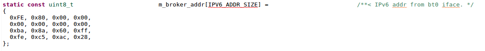
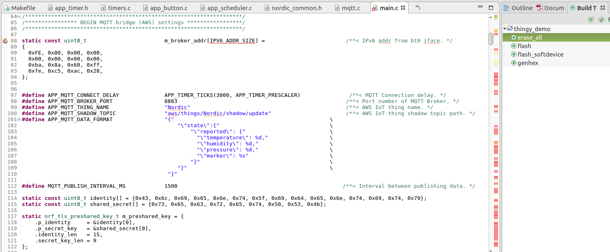
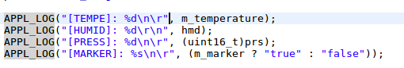

Device (Nordic Thingy:52)
=============

The demo device is [Nordic Thingy:52](https://www.nordicsemi.com/eng/Products/Nordic-Thingy-52). The board is a "thing" for the [AWS IoT](https://aws.amazon.com/iot/) service. It updates its shadow with sensors data every few seconds.

##### Contents

- [Hardware configuration](#hardware-configuration)
- [Build Instruction](#connecting-to-ble-router)
- [Code Highlights](#code-highlights)
- [J-Link Connection Setup](#j-link-connection-setup)
- [Debugging setup](#debugging-setup)
- [External Resources](#external-resources)

### Hardware configuration

- [Nordic Thingy:52](https://www.nordicsemi.com/eng/Products/Nordic-Thingy-52) - IoT Sensor Kit
- [Segger J-Link EDU](https://www.segger.com/products/debug-probes/j-link/models/j-link-edu/) - Debug probe
- [ARM-JTAG-20-10](https://www.olimex.com/Products/ARM/JTAG/ARM-JTAG-20-10/) - Plug-in adapter 20pin to 10pin

### Requirement

1. [Eclipse IDE for GNU ARM & RISC-V C/C++ Developers](https://gnu-mcu-eclipse.github.io/) should be installed.
1. [Segger J-Link Software](https://www.segger.com/downloads/jlink/#J-LinkSoftwareAndDocumentationPack) should be installed and added to `PATH`
1. [nRF5x Command Line Tools](https://www.nordicsemi.com/eng/nordic/Products/nRF51822/nRF5x-Command-Line-Tools-Win32/33444) should be installed and added to `PATH`

### Build Instruction

1. Clone repo.
1. (Optional) Setup local [BLE MQTT Router](./ROUTER.md) 
1. Import Project into Eclipse IDE from [firmware](../firmware) directory.
1. Get MQTT broker ipv6 address.
1. Local broker address shall be set in [main.c](../firmware/project/pca20020_s132/main.c). 

 
1. Execute Make target `erase_all`.
1. Execute Make target `flash_softdevice`.
1. Execute Make target `flash`.

### Code Highlights

_Located in main.c_

1. BLE connection settings and mqtt connection setting shall be set here: 

 
1. Debug output can be seen via Segger RTT (real-time terminal): 

### J-Link Connection Setup

1. Plug-in Segger to USB and Nordic to Segger via Oumex connector.
1. Run on the command line: `JLinkExe`.
1. Execute in the J-Link shell: `connect`.
1. Type `NRF52832_XXAA` as the device name.
1. Select target interface: `SWD`.
1. Specify target interface speed 4000 kHz.

### Debugging Setup

1. Download and install [Segger J-Link Software](https://www.segger.com/downloads/jlink/#J-LinkSoftwareAndDocumentationPack)
1. Setup [Eclipse IDE for GNU ARM & RISC-V C/C++ Developers](https://gnu-mcu-eclipse.github.io/). It contains Jlink support. Just create new debug configuration and run it. Board will be flashed and will work even when debug is disconnected.
1. When debug is launched, run `JlinkRTTClient` to see debug output from `APPL_LOG` functions

### External Resources

- Build Tools
	- [Eclipse IDE for GNU ARM & RISC-V C/C++ Developers](https://gnu-mcu-eclipse.github.io/)
	- [Segger J-Link Software](https://www.segger.com/downloads/jlink/#J-LinkSoftwareAndDocumentationPack)
	- [nRF5x Command Line Tools](https://www.nordicsemi.com/eng/nordic/Products/nRF51822/nRF5x-Command-Line-Tools-Win32/33444)
- SDK
    - [nRF5 SDK for IoT](https://www.nordicsemi.com/eng/Products/Bluetooth-low-energy/nRF5-SDK-for-IoT)
    	